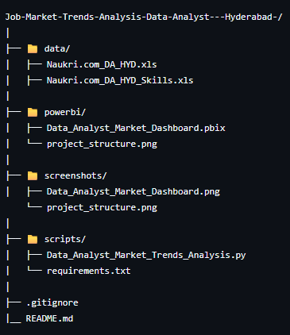
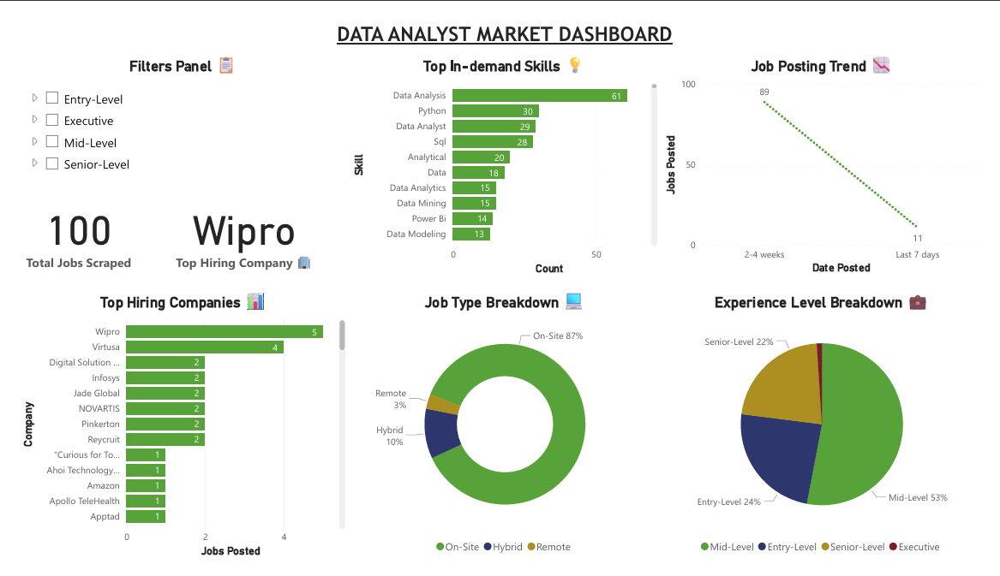

# **Job Market Trends Analysis (Data Analyst - Hyderabad)**

### **DESCRIPTION**

A Python-based Data Analysis model that scrapes Data Analyst job listings from Naukri.com using Python, processes the data with Pandas, and visualizes insights using Power BI.

### **FEATURES**

- Web Scraping using Selenium
- Data Cleaning and Processing
- Feature Engineering
- Extensive Categorization using retrieved data (i.e., Experience Level, Job Type, Date Posted)
- Showcases Top In-demand Skills, Companies with highest Job Postings, Job Posting Trends, etc...
- Interactive Power BI Dashboard with Tooltips & Filters

### **PROJECT STRUCTURE**

### **TOOLS USED**

- Python
- Jupyter Notebook
- Pandas
- Selenium
- Selenium WebDriver
- Power BI
- MS Excel

### **POWER BI DASHBOARD**

### **HOW TO RUN THE PROJECT**

### Python Web Scraper

1. Clone the Repository :
   #### git clone https://github.com/viveikcs/job-market-trends-analysis.git
2. Open CLI
3. Run the command :
   #### cd job-market-trends-analysis/scripts
4. Run the command :
   #### pip install -r requirements.txt
5. Run the .py file

### Power BI Dashboard

1. Open Power BI Desktop
2. Go to File > Open and select :
   #### powerbi/job_market_dashboard.pbix

### **ACKNOWLEDGEMENTS**

- Naukri.com
- Pandas Library Documentation
- Jupyter

### **CONTACT**
Feel free to reach out: viveikcs@gmail.com
